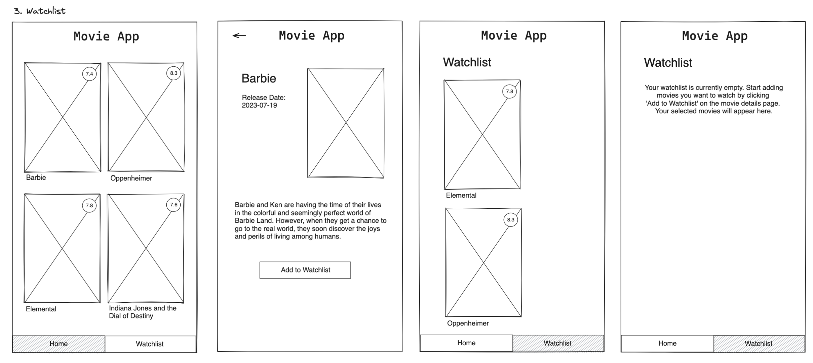

# Movie App - Watchlist

## Value Proposition

As a user  
I want to add a movie to my watchlist as well as switch between ‘Home’ and ‘Watchlist’ 
so that I have the opportunity to personalize my movie app. 

## Description

## Acceptance Criteria

- [ ] Show Nav-Bar at the bottom of the App at Homepage and Watchlist with ‘Home’ and ‘Watchlist’ as tabs (NOT at DetailsPage)
- [ ] On DetailsPage appears a new Button with ‘Add to Watchlist’
- [ ] On WatchlistPage marked/added movies to watchlist are shown
- [ ] Error message if no movie is marked/added to watchlist

## Tasks

- [ ] Create Watchlist-page that shows marked MovieCard-components or error message
- [ ] Create NavBar-component
- [ ] Create a global state ‘isOnWatchlist’
- [ ] Create ‘Add to Watchlist’-button to Detailspage
